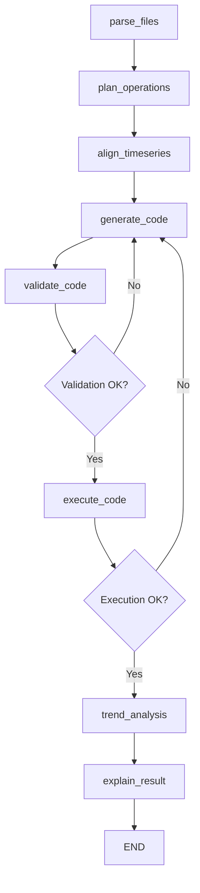

# Architecture Documentation

## System Architecture

```
┌─────────────────┐    ┌─────────────────┐    ┌─────────────────┐
│   Frontend      │    │    Backend      │    │   Database      │
│   (React)       │◄──►│   (FastAPI)     │◄──►│  (PostgreSQL)   │
│   Port: 3000    │    │   Port: 8000    │    │   Port: 5432    │
└─────────────────┘    └─────────────────┘    └─────────────────┘
         │                       │                       │
         │              ┌─────────────────┐              │
         │              │  Celery Worker  │              │
         └──────────────┤   (Background   │──────────────┘
                        │   Processing)   │
                        └─────────────────┘
                                 │
                        ┌─────────────────┐
                        │     Redis       │
                        │  (Message Queue │
                        │   & Caching)    │
                        │   Port: 6379    │
                        └─────────────────┘
```

## Component Overview

| Component | Technology | Purpose | Port |
|-----------|------------|---------|------|
| **Frontend** | React + Material-UI | User interface for file upload and results visualization | 3000 |
| **Backend** | FastAPI + SQLAlchemy | REST API and business logic | 8000 |
| **Workflow Engine** | LangGraph | 8-node analysis workflow orchestration | - |
| **Task Queue** | Celery + Redis | Asynchronous background processing | - |
| **Database** | PostgreSQL | Data persistence and session management | 5432 |
| **Cache** | Redis | Session storage and task result caching | 6379 |

## LangGraph Workflow Architecture

### Workflow Graph


### Node Descriptions

| Node | Purpose | Input | Output |
|------|---------|-------|--------|
| **parse_files** | Ingest CSV/Excel files, extract schemas | File paths, query | Parsed data, schemas |
| **plan_operations** | Analyze requirements, decide strategy | Query, schemas | Analysis plan |
| **align_timeseries** | Align data across time periods | Data, plan | Aligned datasets |
| **generate_code** | Generate Python analysis code using LLM | Aligned data, query | Python code |
| **validate_code** | Syntax validation and security checks | Generated code | Validated code |
| **execute_code** | Safe execution in sandboxed environment | Validated code, data | Execution results |
| **trend_analysis** | Pattern detection and anomaly identification | Results | Trends, patterns |
| **explain_result** | Generate narrative explanations | All results | Final report |

### Conditional Edges & Retry Logic

#### Validation Retry Loop
- **Trigger**: Syntax errors, security issues
- **Max Attempts**: 3
- **Strategy**: Error context fed back to code generation

#### Execution Retry Loop  
- **Trigger**: Runtime errors, timeouts
- **Max Attempts**: 2
- **Strategy**: Execution errors inform new code generation

## 🛠️ Technology Stack

### Backend Stack
```
┌─────────────────────────────────────────┐
│                FastAPI                  │
├─────────────────────────────────────────┤
│              LangGraph                  │
│         (Workflow Engine)               │
├─────────────────────────────────────────┤
│            SQLAlchemy                   │
│         (Database ORM)                  │
├─────────────────────────────────────────┤
│              Celery                     │
│         (Task Queue)                    │
├─────────────────────────────────────────┤
│             Pandas                      │
│        (Data Processing)                │
└─────────────────────────────────────────┘
```

### Frontend Stack
```
┌─────────────────────────────────────────┐
│               React 18                  │
├─────────────────────────────────────────┤
│            Material-UI                  │
│         (Component Library)             │
├─────────────────────────────────────────┤
│              Axios                      │
│         (HTTP Client)                   │
├─────────────────────────────────────────┤
│             Recharts                    │
│        (Data Visualization)             │
└─────────────────────────────────────────┘
```

> **⚠️ Frontend Note**: Built with AI assistance (Kiro's Claude Sonnet 4 and Gemini CLI) due to limited frontend expertise.

### Infrastructure Stack
```
┌─────────────────────────────────────────┐
│              Docker                     │
│         (Containerization)              │
├─────────────────────────────────────────┤
│            PostgreSQL                   │
│         (Primary Database)              │
├─────────────────────────────────────────┤
│              Redis                      │
│      (Cache & Message Broker)           │
├─────────────────────────────────────────┤
│              Nginx                      │
│         (Reverse Proxy)                 │
└─────────────────────────────────────────┘
```

## Project Structure

```
LangGraph-CSV-Analysis-Task/
├── frontend/                    # React frontend application
│   ├── src/
│   │   ├── components/          # Reusable UI components
│   │   ├── pages/               # Page-level components
│   │   ├── services/            # API service layer
│   │   └── utils/               # Utility functions
│   ├── public/                  # Static assets
│   ├── package.json             # Node.js dependencies
│   └── Dockerfile               # Frontend container
│
├── backend/                     # FastAPI backend application
│   ├── app/
│   │   ├── main.py              # FastAPI application entry
│   │   ├── db.py                # Database configuration
│   │   └── logging_conf.py      # Logging setup
│   ├── models/
│   │   └── v2_models.py         # SQLAlchemy data models
│   ├── routers/
│   │   ├── files.py             # File upload endpoints
│   │   └── v2_analytics.py      # Analysis endpoints
│   ├── services/
│   │   ├── llm_providers.py     # Multi-LLM integration
│   │   ├── safe_execution.py    # Code execution sandbox
│   │   ├── error_handling.py    # Error management
│   │   └── security_sanitizer.py # Input validation
│   ├── migrations/              # Database migrations
│   ├── langgraph_workflow.py    # Main workflow logic
│   ├── tasks.py                 # Celery background tasks
│   ├── celery_app.py           # Celery configuration
│   └── requirements.txt         # Python dependencies
│
├── workers/                     # Background processing (Celery)
│   └── (Integrated in backend/)
│
├── langgraph/                   # Workflow definitions
│   └── (Integrated in backend/langgraph_workflow.py)
│
├── db/                          # Database related files
│   └── (Migrations in backend/migrations/)
│
├── tests/                       # Test suite
│   ├── test_api.py              # API endpoint tests
│   ├── test_integration.py      # Integration tests
│   ├── test_installation.py     # Installation tests
│   └── run_tests.py             # Test runner
│
├── sample_data/                 # Test data files
│   ├── sales_q4_2024.csv
│   ├── sales_q1_2025.csv
│   └── *.csv                    # Various test datasets
│
├── docker-compose.yml           # Container orchestration
├── .env.example                 # Environment template
└── README.md                    # Main documentation
```

## Data Flow Architecture

### 1. File Upload Flow
```
User → Frontend → Backend API → File Storage → Database (metadata)
```

### 2. Analysis Request Flow
```
User Query → Frontend → Backend API → Celery Task → LangGraph Workflow
```

### 3. LangGraph Execution Flow
```
parse_files → plan_operations → align_timeseries → generate_code
     ↓
validate_code ←→ (retry loop) ←→ generate_code
     ↓
execute_code ←→ (retry loop) ←→ generate_code  
     ↓
trend_analysis → explain_result → END
```

### 4. Progress Updates Flow
```
LangGraph Nodes → WebSocket → Frontend (Real-time updates)
```

## 🔐 Security Architecture

### Input Validation Layer
```
Frontend Validation → Backend Validation → Sanitization → Processing
```

### Code Execution Security
```
Generated Code → Syntax Check → Security Scan → Sandboxed Execution
```

### API Security
```
Request → Rate Limiting → Authentication → Authorization → Processing
```

## Scalability Considerations

### Horizontal Scaling Points
- **Frontend**: Multiple React instances behind load balancer
- **Backend**: Multiple FastAPI instances with shared database
- **Workers**: Multiple Celery workers for parallel processing
- **Database**: Read replicas for query scaling

### Performance Bottlenecks
1. **LLM API Calls**: Rate limits and latency
2. **File Processing**: Large file memory usage
3. **Code Execution**: CPU-intensive analysis operations
4. **Database**: Complex query performance

### Optimization Strategies
- **Caching**: Redis for frequent queries and results
- **Connection Pooling**: Database connection optimization
- **Async Processing**: Non-blocking I/O operations
- **Resource Limits**: Container memory and CPU limits

## 🔍 Monitoring & Observability

### Health Check Endpoints
- **Backend**: `GET /health`
- **Database**: PostgreSQL connection check
- **Redis**: Redis ping check
- **Workers**: Celery worker status

### Logging Strategy
- **Structured Logging**: JSON format for log aggregation
- **Log Levels**: DEBUG, INFO, WARNING, ERROR, CRITICAL
- **Distributed Tracing**: Request correlation across services

### Metrics Collection
- **Application Metrics**: Request rates, response times, error rates
- **System Metrics**: CPU, memory, disk, network usage
- **Business Metrics**: Analysis completion rates, LLM usage costs

## Deployment Architecture

### Development Environment
```
Local Machine → Docker Compose → All Services
```

### Production Environment
```
Load Balancer → Frontend Containers → Backend Containers → Database Cluster
                                   ↓
                              Worker Containers → Redis Cluster
```

### Container Strategy
- **Multi-stage builds** for optimized image sizes
- **Health checks** for container orchestration
- **Resource limits** for predictable performance
- **Volume mounts** for persistent data